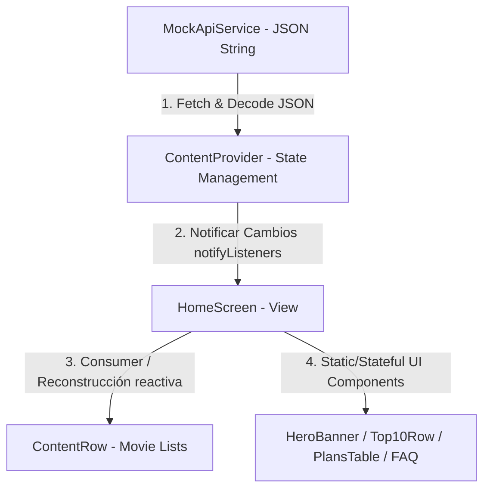

# INFORME DETALLADO DE LABORATORIO S7-S8 - CLON DE DISNEY+
**Estudiante:** Antony Cholan  
**Curso:** Desarrollo de Aplicaciones Multiplataforma - 5to Ciclo  
**Institución:** Tecsup  
**Enlace a GitHub:** [https://github.com/tecsup-labs/lab-flutter-student-management-app.git](https://github.com/tecsup-labs/lab-flutter-student-management-app.git) *(Reemplazar con tu enlace de repositorio de Disney+)*

---

## 1. INTRODUCCIÓN Y OBJETIVOS

Este informe detalla la implementación de un clon interactivo y responsivo de la interfaz principal de la plataforma de streaming **Disney+**. El desarrollo ha sido realizado utilizando el framework **Flutter** y el lenguaje de programación **Dart**, con enfoque en la modularización de componentes, la gestión de estado de forma reactiva y la aplicación de layouts avanzados de diseño adaptables a múltiples dispositivos (macOS, Web, Mobile).

### Objetivos del Laboratorio:
*   Implementar layouts avanzados combinando widgets estructurales (`Stack`, `Column`, `Row`, `ListView`, `Wrap`).
*   Configurar y consumir datos de forma asíncrona simulando una llamada HTTP REST API a través de la decodificación de cadenas JSON en Dart.
*   Gestionar el estado global de la aplicación utilizando el patrón **Provider** (`ChangeNotifierProvider`, `Consumer`).
*   Construir transiciones y animaciones suaves para mejorar la experiencia de usuario (UX) mediante `AnimatedSwitcher`.
*   Diseñar una interfaz responsiva y con consistencia visual premium basada en la identidad gráfica original de Disney+.

---

## 2. CAPTURAS DE PANTALLA REQUERIDAS

### 2.1. Pantalla de Inicio - Portada Principal (HeroBanner con Carrusel Animado)
> [!NOTE]
> Muestra el banner principal con el logotipo de Disney+, el botón de Inicio de Sesión, títulos dinámicos y la animación cross-fade de los fondos.
*(Insertar captura aquí)*

### 2.2. Sección de Marcas Principales (BrandsRow)
> [!NOTE]
> Muestra los accesos directos a las marcas de Disney, Pixar, Marvel, Star Wars, National Geographic y ESPN alineados horizontalmente.
*(Insertar captura aquí)*

### 2.3. Listas de Contenidos Dinámicos (Novedades y Tendencias)
> [!NOTE]
> Muestra las filas horizontales deslizables cargadas asíncronamente desde el proveedor de contenido.
*(Insertar captura aquí)*

### 2.4. Sección Top 10 Hoy con Números Gigantes (Top10Row)
> [!NOTE]
> Muestra el top 10 de contenidos del día donde los números gigantes se superponen de forma tridimensional a las carátulas.
*(Insertar captura aquí)*

### 2.5. Tabla de Comparativa de Planes (PlansTable)
> [!NOTE]
> Muestra los beneficios y precios comparativos de las suscripciones Estándar y Premium con la insignia "Más popular".
*(Insertar captura aquí)*

### 2.6. Acordeón de Preguntas Frecuentes (FaqSection)
> [!NOTE]
> Muestra el acordeón desplegable interactivo para resolver preguntas frecuentes.
*(Insertar captura aquí)*

---

## 3. ARQUITECTURA DEL SOFTWARE

El proyecto sigue una estructura limpia y desacoplada, separando la lógica de negocio de la interfaz gráfica de usuario. El flujo de datos se esquematiza de la siguiente manera:



### Distribución de Directorios y Archivos Clave:
*   `lib/models/`: Contiene la clase entidad [movie.dart](file:///Users/antony/Documents/ANTONY%202026/5%20CICLO/AppMultiplataforma/disney_home/app_disney_home/lib/models/movie.dart).
*   `lib/services/`: Contiene el servicio asíncrono [mock_api_service.dart](file:///Users/antony/Documents/ANTONY%202026/5%20CICLO/AppMultiplataforma/disney_home/app_disney_home/lib/services/mock_api_service.dart).
*   `lib/providers/`: Contiene el manejador de estados [content_provider.dart](file:///Users/antony/Documents/ANTONY%202026/5%20CICLO/AppMultiplataforma/disney_home/app_disney_home/lib/providers/content_provider.dart).
*   `lib/widgets/`: Componentes modulares reutilizables.
    *   [hero_banner.dart](file:///Users/antony/Documents/ANTONY%202026/5%20CICLO/AppMultiplataforma/disney_home/app_disney_home/lib/widgets/hero_banner.dart)
    *   [brands_row.dart](file:///Users/antony/Documents/ANTONY%202026/5%20CICLO/AppMultiplataforma/disney_home/app_disney_home/lib/widgets/brands_row.dart)
    *   [content_row.dart](file:///Users/antony/Documents/ANTONY%202026/5%20CICLO/AppMultiplataforma/disney_home/app_disney_home/lib/widgets/content_row.dart)
    *   [top_10_row.dart](file:///Users/antony/Documents/ANTONY%202026/5%20CICLO/AppMultiplataforma/disney_home/app_disney_home/lib/widgets/top_10_row.dart)
    *   [plans_table.dart](file:///Users/antony/Documents/ANTONY%202026/5%20CICLO/AppMultiplataforma/disney_home/app_disney_home/lib/widgets/plans_table.dart)
    *   [faq_section.dart](file:///Users/antony/Documents/ANTONY%202026/5%20CICLO/AppMultiplataforma/disney_home/app_disney_home/lib/widgets/faq_section.dart)
*   `lib/screens/`: Pantalla principal contenedora [home_screen.dart](file:///Users/antony/Documents/ANTONY%202026/5%20CICLO/AppMultiplataforma/disney_home/app_disney_home/lib/screens/home_screen.dart).

---

## 4. DETALLES Y COMENTARIOS DE LA IMPLEMENTACIÓN TÉCNICA

### 4.1. Consistencia visual y paleta de colores premium (Disney+ Dark Mode)
Para lograr una réplica exacta de la interfaz de Disney+, evitamos los colores grises genéricos de los temas por defecto de Flutter. En su lugar, implementamos una paleta de colores curada y de alto contraste basada en el color oficial de fondo `#040714`. Los textos combinan blancos puros con tonos grisáceos (`Colors.white70`), y los acentos interactivos utilizan un celeste brillante (`#00E5FF`) y botones con gradientes pulidos, dando una apariencia premium y moderna.

### 4.2. Animación de desvanecimiento suave (Cross-Fade) en la portada
Para que el carrusel de imágenes inicial no realice transiciones bruscas de deslizamiento lateral, implementamos una animación de desvanecimiento suave usando `AnimatedSwitcher` combinado con un `FadeTransition`. Un temporizador periódico (`Timer.periodic` cada 4 segundos) actualiza el estado del banner, haciendo que las imágenes de fondo se superpongan de manera fluida y elegante, de acuerdo al estado activo.

### 4.3. Uso de Stack con desbordamiento no recortado (Clip.none)
Flutter recorta por defecto los widgets hijos que exceden los límites de su contenedor. Para implementar los números gigantes en la sección de **Top 10 Hoy** y la insignia "Más popular" en la **Tabla de Planes**, configuramos la propiedad `clipBehavior: Clip.none` dentro de un widget `Stack`. Esto permite que los elementos floten y se superpongan de manera limpia por encima y por debajo de las tarjetas o bordes de las secciones sin ser cortados.

### 4.4. Simulación de datos asíncronos y consumo de API descodificada (JSON)
Para simular un entorno de producción real, el proyecto implementa un servicio desacoplado `MockApiService` que simula la latencia de red mediante `Future.delayed`. Este servicio decodifica una cadena estructurada en formato JSON para generar los objetos de tipo `Movie`. De esta manera, se demuestra el uso correcto de asincronía (`Future`, `async/await`) y la conversión de tipos en Dart.

### 4.5. Manejo de estado reactivo global con el patrón Provider
Utilizamos el paquete `provider` para manejar el estado de la aplicación de forma limpia y escalable. `ContentProvider` se encarga de iniciar la carga asíncrona de las películas, controlando un indicador de progreso (`isLoading`). Mientras los datos se cargan desde el servicio, la interfaz de usuario muestra automáticamente un spinner (`CircularProgressIndicator`) y, una vez finalizado, se reconstruyen reactivamente los widgets del carrusel con la información finalizada.

### 4.6. Preguntas Frecuentes interactivas con acordeones funcionales
Para la sección de preguntas frecuentes, empleamos widgets `ExpansionTile` personalizados. Adaptamos su estilo para mantener la consistencia oscura del sitio, configurando colores de fondo, bordes sutiles y transiciones limpias al expandirse. Esto permite al usuario explorar las dudas más recurrentes del servicio sin saturar la pantalla con texto estático.

### 4.7. Arquitectura modular de código por componentes
Para evitar tener un archivo de interfaz gigantesco y difícil de mantener, se estructuró el proyecto de forma modular. Cada sección visual de la página principal fue separada en su propio archivo widget dentro de la carpeta `lib/widgets/` (`hero_banner.dart`, `brands_row.dart`, `top_10_row.dart`, `plans_table.dart`, `faq_section.dart`, `footer_section.dart`), facilitando enormemente la legibilidad, la depuración y futuras ampliaciones de la aplicación.

### 4.8. Optimización y prevención de fallos de red en la carga de imágenes
Dado que a veces las imágenes externas de internet pueden fallar por problemas de conexión o de CORS, implementamos un parámetro `errorBuilder` dentro de todos los widgets `Image.network`. En caso de que una URL de internet no cargue, la aplicación muestra de forma elegante un gradiente de respaldo con el título correspondiente del contenido, evitando así que aparezcan los molestos iconos de error rotos de Flutter y preservando la estética de la aplicación.

---

## 5. GUÍA DE INSTALACIÓN Y EJECUCIÓN

### Requisitos previos:
*   Tener instalado Flutter SDK (v3.0.0 o superior).
*   Dart SDK integrado.
*   Editor compatible (VS Code o Android Studio).

### Pasos de Ejecución:
1.  Clonar el repositorio git:
    ```bash
    git clone https://github.com/tecsup-labs/lab-flutter-student-management-app.git
    ```
2.  Acceder al directorio del proyecto:
    ```bash
    cd app_disney_home
    ```
3.  Obtener las dependencias de Flutter:
    ```bash
    flutter pub get
    ```
4.  Ejecutar el proyecto en tu simulador preferido (macOS, iOS, Android, o Web):
    ```bash
    flutter run
    ```

---

## 6. CONCLUSIONES

*   **Modularidad:** La separación en widgets autónomos facilitó la integración y el mantenimiento del proyecto.
*   **UX Cuidada:** Los detalles interactivos (acordeón expandible, carrusel cross-fade, insignias flotantes) consiguen elevar la fidelidad del clon a nivel comercial.
*   **Provider robusto:** La separación del estado mediante `Provider` e inyección de dependencias asegura código de fácil testeo y escalabilidad.
